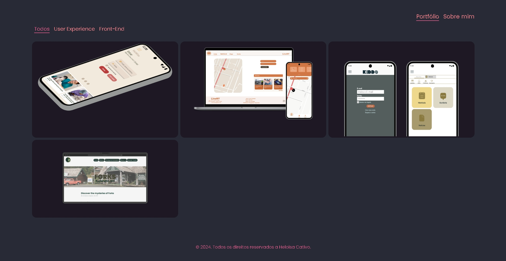
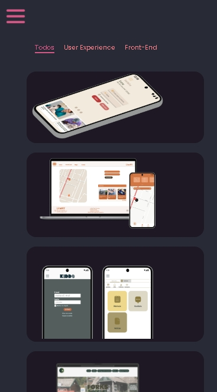

   
  

---

<section id="br">

<h1>Oi! Esse é meu portfólio pessoal</h1>

Se você explorar meu portfólio, encontrará meus projetos pessoais

<h2> Ferramentas </h2>

<h2>Preview</h2>

Desktop

Mobile

</section>
 
<section id="en">
<h1>Hi there! This is my personal portfolio</h1>

In my portfolio, you will find some personal projects where I applied my skills.

<h2> Tools </h2>

<h2> Preview </h2>

Desktop

Mobile

